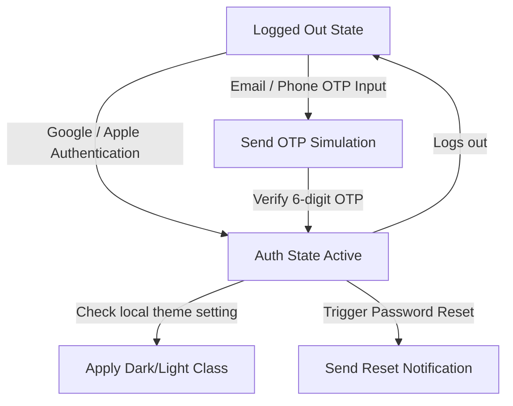

# Health Scanner AI - Technical Architecture & Schema

This document details the single-page web application architecture, data models, authentication flows, and AI analysis pipelines for the **Health Scanner AI** app.

## 1. Project Directory Structure

```text
/stitch_health_scanner_ai_engine
├── index.html                   # Core single-page HTML skeleton and layouts (Tailwind CDN)
├── styles.css                   # Custom global styling, glassmorphism, scanner lasers, & dark mode overrides
├── jellyfish.js                 # HTML5 Canvas fluid dynamic jellyfish background simulation
├── database.js                  # LocalStorage data persistence layer with seed scan history
├── aiEngine.js                  # Simulated multi-stage clinical AI scanning engine
├── auth.js                      # Multi-method authentication state manager (Google/Apple/Email & Phone OTP)
├── app.js                       # Main application driver, screen coordinator, camera engine, and UI binder
└── project_structure_schema.md  # Technical specification sheet (this file)
```

## 2. Local Database Schema (LocalStorage)

Data is saved as JSON strings under the key `health_scanner_scans` inside the user's browser storage.

### `Scan` Object Structure
```typescript
interface Scan {
  id: string;               // Unique GUID for the scan
  foodName: string;         // Identified food item name
  timestamp: string;        // ISO-8601 string of the scan date
  calories: number;         // Total energy in kcal
  nutrients: {
    protein: number;        // in grams
    carbs: number;          // in grams
    fats: number;           // in grams
    sodium: number;         // in milligrams
    fiber: number;          // in grams
    sugar: number;          // in grams
    saturatedFat: number;   // in grams
    monounsaturatedFat: number; // in grams
  };
  verdict: 'Excellent' | 'Good' | 'Moderate' | 'Avoid'; // Clinical safety indicator
  verdictDescription: string; // Explanatory medical reason for the verdict
  alternative: string;      // Healthier recommended alternative item
  alternativeIcon: string;  // Icon name for the alternative
  tags: string[];           // Array of nutritional tags (e.g. "Vegan", "High-Protein")
  insights: {
    title: string;          // Insight name (e.g. "Fitness Impact")
    description: string;    // Medical advice text
    icon: string;           // MD material symbol icon code
  }[];
  imageUrl: string;         // Local placeholder or uploaded image URL (base64 data-URL if uploaded)
}
```

## 3. Authentication Flow State Diagram



## 4. Multi-Stage AI Scanning Pipeline

The `aiEngine.js` processes scans through four asynchronous stages with progress hooks to update the scanning UI with technical details:

1. **Stage 1: Pre-processing & Artifact Filtering** (Ingests raw image data, isolates food pixels, runs noise reduction filters)
2. **Stage 2: Deep Learning Neural Classification** (Passes feature maps through deep convolutional neural network nodes for classification)
3. **Stage 3: Nutritional Biomarker Extraction** (Maps classification results to clinical USDA nutrition databases to calculate macronutrient ratios)
4. **Stage 4: Verdict Matrix & Health Recommendations** (Compares stats against daily allowance values to determine safety level and suggest alternatives)
